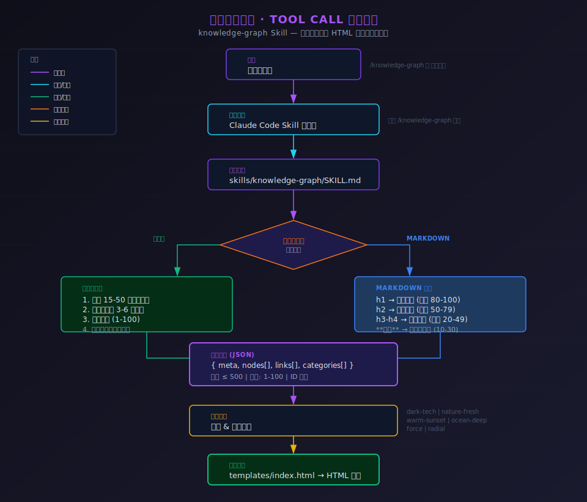

# Knowledge Graph Map 知识图谱

支持将指定的markdown格式文件或JSON数据，转换成可交互式、单一可运行的知识图谱网页。同时支持布局（环形、力导图）和主题指定。可使用 CLI 和 Claude Code Skill 双模式进行安装。

[](https://www.npmjs.com/package/knowledge-graph-map)


**npm**: https://www.npmjs.com/package/knowledge-graph-map

## 安装

```bash
# 直接使用（无需安装）
npx knowledge-graph-map -f data.json

# 或全局安装
npm install -g knowledge-graph-map
knowledge-graph-map -f data.json
```

### Claude Code Skill 安装

```bash
# 通过 npx skills 安装（推荐）
npx skills add AragornZJF/knowledge-graph-map --skill knowledge-graph

# 或使用内置安装命令
npx knowledge-graph-map --install-skill
```

## 快速开始

### CLI 模式

```bash
# 从 JSON 文件生成
npx knowledge-graph-map -f data.json

# 从 Markdown 文件生成
npx knowledge-graph-map -f notes.md

# 指定布局和主题
npx knowledge-graph-map -f data.json --layout radial --theme dark-tech

# 指定输出路径
npx knowledge-graph-map -f data.json -o my-graph.html
```


### Claude Code Skill

在 Claude Code 中使用 `/knowledge-graph` 命令或自然语言触发：

```
> /knowledge-graph 机器学习
> 生成一个关于人工智能的知识图谱
> 把这个 markdown 文档可视化为知识图谱
```

## 输入格式

### JSON 格式

- 可使用DeepSeek、Claude 大模型等，将markdown核心概念转JSON 后使用该技能

```json
{
  "meta": { "title": "图谱标题", "layout": "force", "theme": "dark-tech" },
  "nodes": [
    { "id": "1", "name": "概念", "category": "分类", "weight": 80 }
  ],
  "links": [
    { "source": "1", "target": "2", "relation": "关系" }
  ],
  "categories": ["分类1", "分类2"]
}
```

### Markdown 格式

```markdown
# 核心概念
## 子概念
### 细节
**关键词** 会自动提取为节点
```

## 主题

| 主题 | 说明 |
|------|------|
| dark-tech | 暗色科技风（默认） |
| nature-fresh | 自然清新风 |
| warm-sunset | 暖阳落日风 |
| ocean-deep | 深海幽蓝风 |

## 布局

| 布局 | 说明 |
|------|------|
| force | 力导向布局（默认） |
| radial | 辐射状布局 |

## CLI 参数

```
-f, --file <path>       输入 JSON 或 Markdown 文件路径
--title <string>        图谱标题
-l, --layout <type>     布局: force | radial
--theme <name>          主题
-o, --output <path>     输出路径
--no-open               不自动打开浏览器
```

## 流程图




## License

MIT
